# 🌌 ModelMarket | Gasless AI Micro-Transactions & Invisible Blockchain

ModelMarket is a high-fidelity, decentralized AI model studio engineered to make AI usage completely frictionless. Powered by the **Universal Gas Framework (UGF)**, it abstracts away Web3 complexity (gas fees, native token barriers, and blockchain transaction friction) to deliver a seamless, **"Invisible Blockchain"** payment experience tailored for mainstream adoption.

---

## 🔗 Project Links & Assets

| Asset | Link |
| :--- | :--- |
| **🚀 Live App** | [ModelMarket \| Gasless AI Micro-transactions](ADD_DEPLOYED_LINK_HERE) |
| **💻 Codebase** | [Mhatreyash/ModelMarket](https://github.com/Mhatreyash/ModelMarket) |
| **📊 Presentation (PPT)** | [Google Slides Link](https://docs.google.com/presentation/d/1oXl7wq7n2cSXt_HjuVYnG5gh1M9diWWX/edit?usp=sharing&ouid=107256316222873081826&rtpof=true&sd=true) |
| **🎥 Demo Video** | [Watch Video on Google Drive](https://drive.google.com/file/d/1NWqhGFHT-qLPuzX-LEuSIRX2ZX_0Lch2/view?usp=drivesdk) |

---

## 🔮 The invisible Blockchain Experience

AI application developers struggle with **transaction inertia**—forcing users to install wallets, acquire native testnet gas tokens (like Base Sepolia ETH), and sign multiple slow popups just to test a single prompt.

ModelMarket leverages UGF to solve this:
1. **Developer Centered Design:** Easily integrate premium AI capabilities using standard HTTP and on-chain verified proofs.
2. **True Gasless Transactions:** The end-user pays a tiny flat-rate execution cost in digital dollars (e.g. $0.05 Mock USD) while UGF abstracts and handles the gas fee on Base Sepolia invisibly.
3. **No Setup Friction:** Users do not need native ETH balances. A standard ERC-20 approval enables direct micro-payments with a single gasless signature request.

---

## 🚀 Key Features

### ⚡ Interactive Models Studio
* **Resume Roaster AI (Gemini 2.5 Flash):** Get brutally honest, Silicon Valley recruiter feedback on resume drafts with sarcasm and structural insights.
* **Code Reviewer Pro (Gemini 2.5 Flash):** Get instant PR audits, syntax reviews, performance bottlenecks, and security risk indicators.
* **Social Caption Gen (Llama 3.3 via Groq):** Generate high-engagement copy tailored specifically for LinkedIn, X (Twitter), and Instagram with targeted viral hooks.

### 🎨 Premium Aesthetics & UX
* **Visual Story Scroll:** A custom, high-end vertical scroll flow (`story-scroll.tsx`) mapping key user actions and core conceptual features.
* **Canvas Particles Engine:** Interactive canvas-drawn gravity particles acting as a dynamic background across light/dark modes.
* **Frosted Glassmorphism:** Heavy `backdrop-blur-2xl` glass card frames, neon-glow borders, and layered shadows giving a clean SaaS console look.
* **Synchronized Dynamic Theming:** Elegant theme transitions using curated HSL color systems.

### 📊 Real-Time Models Dashboard
* **Web3 Profile:** Fetches your Base Sepolia wallet address, active networks, and balances.
* **LED Payment Ledger:** A live, translucent ledger that polls our backend indexing ledger every 5 seconds, updating table records dynamically on the fly.
* **Interactive Live Simulation Tool:** An instant simulation trigger allowing hackathon judges to verify ledger updates, spend metrics, and model run distributions without needing wallet setups.
* **API Key Manager:** Masked credential generator with single-click clipboard copying to let devs integrate UGF AI streams inside external terminals.
* **CSS-Only Analytics:** Beautiful weekly usage analytics and share metrics charts showing run distributions.

---

## 🏗️ Architecture & Payment Lifecycle

The diagram below details the end-to-end data and payment verification flow:

```mermaid
sequenceDiagram
    autonumber
    actor User as User Wallet
    participant FE as ModelMarket Studio (Next.js)
    participant UGF as UGF SDK Modal
    participant BC as Base Sepolia Testnet
    participant API as Next.js API Route (Guard)
    participant BE as Node.js Indexer (Port 4001)

    User->>FE: Connect Wallet & Paste Prompt
    Note over FE: Ethers.js forces network switch to Base Sepolia (0x14a34)
    FE->>User: Request Mock USD approval (if allowance < cost)
    User->>BC: Approve ModelMarket contract (MUSD allowance)
    FE->>FE: Encode smart contract calldata `payForAI(developer, amount, promptId)`
    FE->>UGF: Open UGF Modal with Signer & calldata
    UGF->>User: Request signature approval
    User->>UGF: Confirm signature
    Note over UGF: UGF executes transaction on-chain & covers native gas fee
    UGF->>FE: Return on-chain Transaction Hash (txHash)
    
    rect rgb(6, 12, 22)
        Note right of FE: Secure Verification Phase
        FE->>API: Send Prompt Text + txHash
        API->>BC: Validate txHash status & logs (Viem RPC client)
        BC-->>API: Confirm verified receipt
        API->>API: Initialize Gemini 2.5 Flash / Groq Llama 3.3
        API-->>FE: Return AI Inference Response
    end

    FE->>BE: Log micro-payment metadata (POST /payments)
    FE->>User: Render gorgeous output in dashboard
    Note over FE: Dashboard Ledger polls GET /payments (every 5s) & updates graphs
```



---

## 🛠️ Technology Stack

### Smart Contracts (Blockchain)
* **Hardhat & TypeScript:** Development, compilation, and testing environment.
* **Ethers.js:** Contract deployment scripts targeting Base Sepolia.
* **OpenZeppelin Contracts:** Audited implementations of the ERC-20 standard.
* **Contracts:**
  * [`MockUSD.sol`](contracts/contracts/MockUSD.sol): Faucet-enabled digital dollar (`MUSD`) with `1,000,000` tokens minted on constructor creation.
  * [`ModelMarket.sol`](contracts/contracts/ModelMarket.sol): Main billing contract. Moves `MUSD` from User -> Developer via `payForAI` and emits `AIPaymentReceived` event logs.

### Backend Indexer
* **Lightweight Node.js HTTP Server:** Pure, lightweight Node `http` backend (`server.js`) running on port `4001`.
* **Index Data Routes:** 
  * `POST /payments`: Logs verified transaction structures, prompts, and costs.
  * `GET /payments`: Serves active ledger JSON for frontend analytics dashboard tracking.

### Frontend App
* **Next.js 15 (App Router):** Core architecture using TypeScript & React 19.
* **Styling:** Vanilla CSS & Tailwind CSS with frosted glass custom cards and HSL tokens.
* **Web3 SDKs:** `@tychilabs/react-ugf` (UGF Modal integrations), `ethers` (Viem fallback for chain receipts).
* **AI Engine:** `@google/generative-ai` (Gemini API integration), Groq Cloud SDK compatibility.

---

## ⚙️ Environment Configuration

Set up environmental variables for local run verification.

### Frontend Config
Create `frontend/.env.local` inside the frontend directory:
```env
# Contract Deployments (Base Sepolia Addresses)
NEXT_PUBLIC_MODEL_MARKET_ADDRESS=0xYourDeployedModelMarketAddress
NEXT_PUBLIC_MOCK_USD_ADDRESS=0xYourDeployedMockUSDAddress
NEXT_PUBLIC_DEVELOPER_ADDRESS=0xYourDeveloperPayoutAddress

# API Configuration
NEXT_PUBLIC_BACKEND_URL=http://localhost:4001
NEXT_PUBLIC_BASE_RPC_URL=https://sepolia.base.org

# AI Engine Keys (Optional: Fallbacks to sandboxes if empty)
GEMINI_API_KEY=your_gemini_api_key_here
GROQ_API_KEY=your_groq_api_key_here
```

### Blockchain Config
Create `contracts/.env` inside the contracts directory:
```env
PRIVATE_KEY=your_wallet_private_key_here
```

---

## 🚀 Getting Started

### 1. Compile & Deploy Smart Contracts
Ensure your contract environment is installed and configured:
```bash
# Enter the contracts workspace
cd contracts

# Install dependencies
npm install

# Compile Solidity blueprints
npx hardhat compile

# Deploy contracts to Base Sepolia network
npx hardhat run scripts/deploy.ts --network base-sepolia
```
*Note the returned `MockUSD` and `ModelMarket` contract addresses and add them to your `frontend/.env.local` configuration.*

### 2. Launch the Backend Indexer
Set up the ledger server in a separate terminal:
```bash
# Enter backend workspace
cd backend

# Start server
node server.js
```
*The ledger server will start running at [http://localhost:4001](http://localhost:4001).*

### 3. Run the Next.js Frontend
Fire up the responsive models studio:
```bash
# Enter frontend workspace
cd frontend

# Install package modules
npm install

# Start Next local dev environment
npm run dev
```
*Open [http://localhost:3000](http://localhost:3000) to view the ModelMarket console in your local browser.*

---

## 🛡️ Sandbox & Developer Fallbacks
To make evaluation frictionless for hackathon judges:
1. **No Wallet Connected?** The frontend will prompt a clean web3 connect card. You can also trigger the **Test Transaction Simulation** directly on the dashboard to immediately inject logs, update weekly run charts, and modify model share distributions in real-time.
2. **Missing AI API Keys?** If `GEMINI_API_KEY` or `GROQ_API_KEY` are not configured in your `.env.local` file, our Next.js API routes will automatically trigger detailed sandbox fallbacks so you can still preview rich model outcomes, system ratings, and formatting tools seamlessly.
3. **Sandbox Payments:** Entering transaction hashes starting with `0xFake` will bypass active RPC queries, enabling instant local sandbox testing.

---

## 📄 License
This project is licensed under the MIT License - see the [LICENSE](LICENSE) file for details.