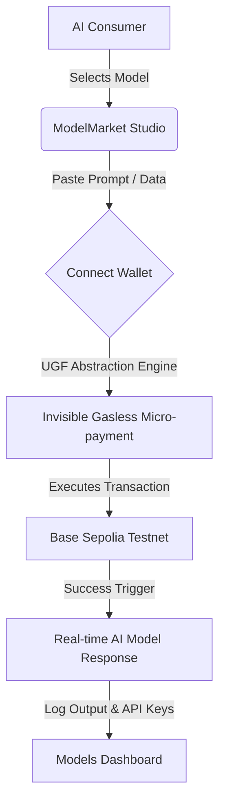

# 🌌 ModelMarket | Gasless AI Micro-transactions

ModelMarket is a high-fidelity, decentralized AI model studio engineered to make AI usage completely frictionless. Powered by the **Universal Gas Framework (UGF)**, it abstracts away Web3 complexity (gas fees, transaction approvals, and blockchain delays) to deliver a seamless, **"Invisible Blockchain"** payment experience tailored for mainstream adoption.

---

## ✨ Features

### 🎨 Premium User Experience & Aesthetics
* **Dynamic Dark/Light Transitions:** Fully synchronized, smooth visual transitions utilizing custom HSL color palettes.
* **Particle Antigravity Engine:** Interactive canvas-drawn particles background scaling cleanly to both themes.
* **Frosted Glassmorphism:** Heavy `backdrop-blur-2xl` glass card frames, layered shadows, and delicate borders for high-end SaaS quality.
* **Vibrant Gradient backdrops:** Bright, subtle glowing mesh layers (Amber, Orange, Purple, Cyan, and Blue) enhancing UI elements in dark mode.
* **Cohesive Design System:** 100% curved pill-shaped button styles and strict typography bounds.

### ⚡ Interactive Models Dashboard
* **Instant Wallet Synced Profile:** Seamlessly fetches connected Metamask address/status on Base Sepolia.
* **Live Micro-payment Logging:** Translucent table capturing real-time transaction ledger state.
* **Interactive Live Simulation Tool:** Action buttons simulating on-the-fly UGF transactions so hackathon judges can immediately see live data flows, spend metrics, and model run distributions update dynamically.
* **SDK API Key Manager:** Fully secure masking UI with clipboard copy integration.
* **Responsive Visual Analytics:** CSS-only weekly usage bar graphs with interactive hover nodes and tooltip values.

---

## 🛠️ Technology Stack

* **Core Framework:** Next.js (App Router)
* **Language:** TypeScript / React 19
* **Styling:** Tailwind CSS (Modern Glassmorphic utility design system)
* **Icons:** Lucide React
* **Theming:** next-themes (Light / Dark mode integration)
* **Gas Abstraction Layer:** Universal Gas Framework (UGF) protocol

---

## 🚀 Getting Started

### Prerequisites
* [Node.js](https://nodejs.org/) (v18.x or later recommended)
* [MetaMask](https://metamask.io/) or any standard Web3 Browser Wallet (for connected Web3 profile integrations)

### Installation
1. Clone the repository:
   ```bash
   git clone https://github.com/your-username/ModelMarket.git
   cd ModelMarket
   ```

2. Go to the frontend workspace:
   ```bash
   cd frontend
   ```

3. Install dependencies:
   ```bash
   npm install
   ```

4. Launch the local development server:
   ```bash
   npm run dev
   ```
   *Open [http://localhost:3000](http://localhost:3000) to view it in your browser.*

5. Compile a production build:
   ```bash
   npm run build
   ```

---

## 🏗️ Architecture



---

## 🌍 Abstracting the Complexities
AI apps suffer from transaction inertia. By utilizing the **Universal Gas Framework**, ModelMarket guarantees:
1. **Developer Centered Design:** Easily integrate AI capabilities using standard HTTP JSON-RPC wrappers.
2. **True Gasless Transactions:** The end-user pays a tiny flat-rate execution cost (e.g. $0.10) while UGF pays the network transaction fee on Sepolia invisibly behind the scenes.
3. **No Setup Friction:** Users are not forced to acquire native token balances (ETH) before testing out new models.

---

## 📄 License
This project is licensed under the MIT License - see the [LICENSE](LICENSE) file for details.